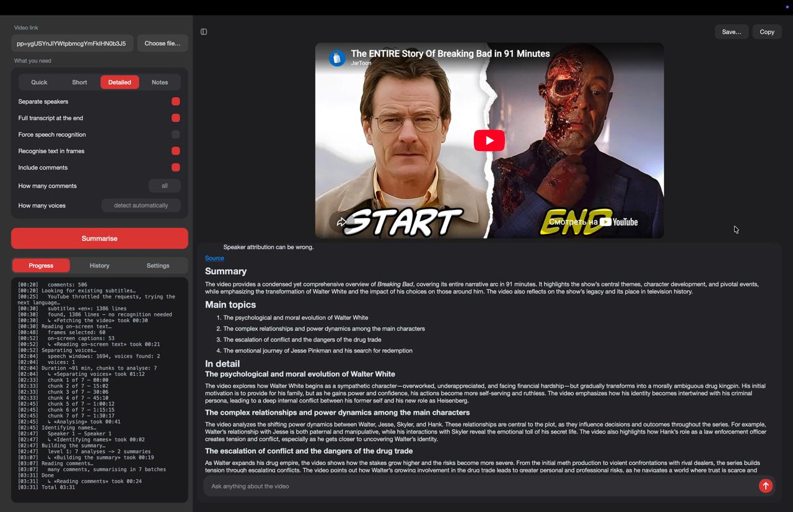
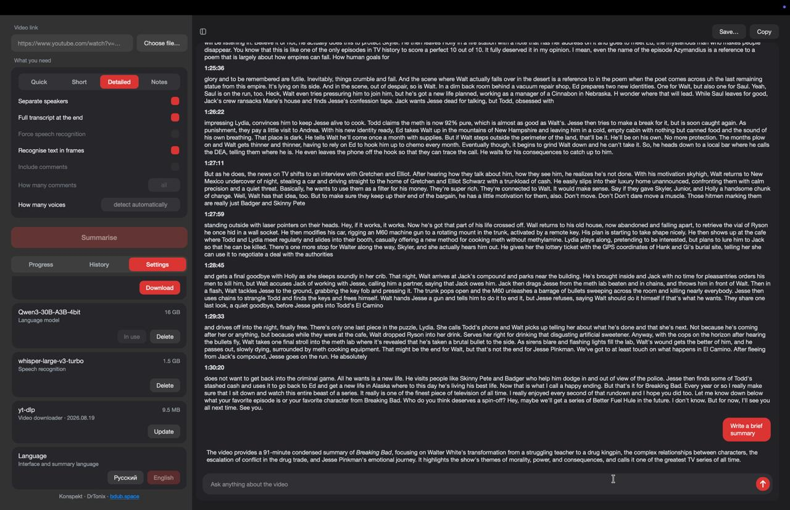
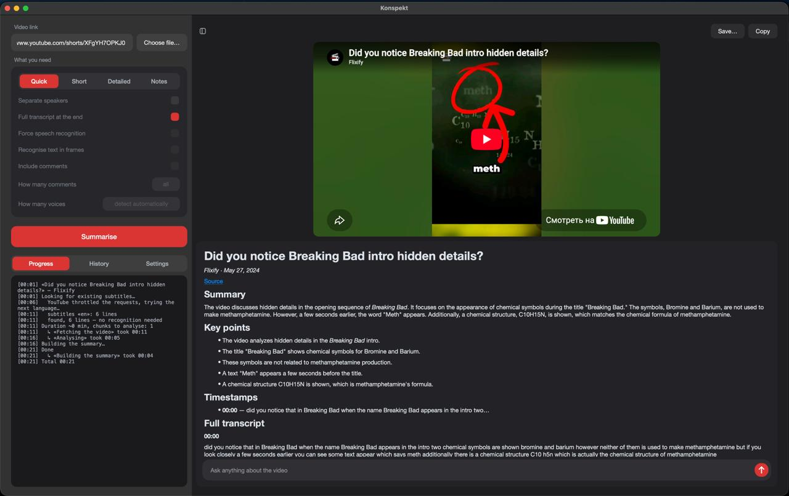

# Konspekt

Turns a video into a structured summary, entirely on your Mac.

[Русский](#konspekt-1)



## Download

**[Konspekt.dmg](https://github.com/Drtonix/Konspekt/releases/latest/download/Konspekt.dmg)**
— 666 MB.

First launch goes through right-click → **Open** → **Open**. Then pick a
language model in Settings.

## Requirements

Apple Silicon, macOS 13 or newer. Intel Macs are not supported.

| Model | Size | RAM |
|---|---|---|
| Qwen3-8B, 4-bit | 4.5 GB | 16 GB |
| Qwen3-30B-A3B, 4-bit | 16 GB | 32 GB |
| Whisper large-v3-turbo | 1.5 GB | — |

## Measured

Test machine: MacBook Pro, M4 Max (14-core CPU, 410 GB/s memory bandwidth),
36 GB, macOS 27. 30B model, cold start included.

| Job | Mode | Time |
|---|---|---|
| 2-hour podcast, site subtitles | Quick | 44 s |
| 37-minute talk, site subtitles, speakers separated | Short | 87 s |
| the same video transcribed locally instead | Short | 117 s |
| 1-minute clip, transcription plus on-screen text | Short | 43 s |

Local transcription runs at about 40× real time.

## Other Macs

Not measured — extrapolated from the numbers above.

| Mac | Qwen3-8B | Qwen3-30B-A3B |
|---|---|---|
| M1–M6, 16 GB | works, summaries roughly 2–4× slower | does not fit |
| M1–M6 Pro, 24 GB | works | does not fit |
| M1–M6 Pro, 32–48 GB | works | works, roughly 1.5–2× slower |
| M1–M6 Max / Ultra, 32 GB+ | works | at or above the times above |

Memory matters more than generation: an M1 Max with 32 GB beats an M6 with
16 GB here, because the model fits.

## Features

**Sources.** Any site yt-dlp handles, or a local file dropped on the window.
Tested end to end on YouTube, TikTok, VK Video and Rutube.

**Modes.** Quick — 5–7 sentences. Short — the gist. Detailed — every topic and
the links between them. Notes — definitions, facts, takeaways.

**Transcript.** Site subtitles when they exist, local Whisper otherwise.
Forcing Whisper is a checkbox: better wording and real punctuation, costs a
download and about two minutes per hour of video.

**Speakers.** Voices are separated and given names where the video gives
enough to name them. The count can be set by hand.

**On-screen text.** Captions burned into the video are read and used as
content. Switches on by itself when there is little speech.

**Comments.** A separate section on what viewers dispute, correct and add.
Pinned and author comments weigh more. Count configurable up to all of them.

**Timestamps.** Author chapters when the video has them, generated
otherwise.



**Questions.** Ask about the video once the summary is built.

**History.** Markdown in `Documents/Konspekt`, reopened, re-run or deleted
from the list.

**Languages.** Russian and English, both interface and summaries.

A Short, start to finish, in 21 seconds:



## Build

```
git clone git@github.com:Drtonix/Konspekt.git
cd Konspekt
./build_app.sh
```

The first run compiles FFmpeg from source, which takes a while. Output is
`build/Konspekt.app`, about 1.8 GB. Speaker weights (98 MB) come from
`fetch_models.sh`, which the build calls. `./make_dmg.sh` packs the installer
and needs `pip install dmgbuild`.

To run from source: install `PySide6 mlx-lm mlx-whisper sherpa-onnx soundfile
scipy numpy yt-dlp pyobjc-framework-Vision pyobjc-framework-Quartz` into a
virtualenv, run `./fetch_models.sh`, start `python app.py`, keep FFmpeg on
`PATH`.

## Limits

- Comments exist only where yt-dlp exposes them: YouTube yes, TikTok and VK no.
- Voices under 6% of the recording are folded into the nearest speaker.
- The language model occasionally slips on Russian agreement.
- Login-gated sites — Vimeo, Instagram — do not work.

## License

MIT, see [LICENSE](LICENSE). Bundled components and model weights are listed in
[THIRD-PARTY.md](THIRD-PARTY.md).

DrTonix · [bdub.space](https://bdub.space)

---

# Konspekt

Превращает видео в структурированный конспект целиком на вашем Mac.

[English](#konspekt)


## Установка

**[Konspekt.dmg](https://github.com/Drtonix/Konspekt/releases/latest/download/Konspekt.dmg)**
— 666 МБ.

Первый запуск — через правую кнопку → **Открыть** → **Открыть**. Дальше
выбрать языковую модель в настройках.

## Требования

Apple Silicon, macOS 13 или новее. Mac на Intel не поддерживаются.

| Модель | Размер | Память |
|---|---|---|
| Qwen3-8B, 4 бита | 4,5 ГБ | 16 ГБ |
| Qwen3-30B-A3B, 4 бита | 16 ГБ | 32 ГБ |
| Whisper large-v3-turbo | 1,5 ГБ | — |

## Замеры

Тестовая машина: MacBook Pro, M4 Max (14 ядер, пропускная способность памяти
410 ГБ/с), 36 ГБ, macOS 27. Модель 30B, с холодного старта.

| Задача | Режим | Время |
|---|---|---|
| двухчасовой подкаст, субтитры площадки | Быстро | 44 с |
| 37-минутный ролик, субтитры площадки, разделение голосов | Кратко | 87 с |
| он же со своим распознаванием вместо субтитров | Кратко | 117 с |
| минутный клип, распознавание плюс текст с кадров | Кратко | 43 с |

Своё распознавание идёт примерно в 40 раз быстрее реального времени.

## Другие Mac

Не измерялось — прикидка от чисел выше.

| Mac | Qwen3-8B | Qwen3-30B-A3B |
|---|---|---|
| M1–M6, 16 ГБ | работает, конспект в 2–4 раза дольше | не помещается |
| M1–M6 Pro, 24 ГБ | работает | не помещается |
| M1–M6 Pro, 32–48 ГБ | работает | работает, в 1,5–2 раза дольше |
| M1–M6 Max / Ultra, 32 ГБ и выше | работает | как в таблице выше или быстрее |

Памяти здесь важнее поколения: M1 Max с 32 ГБ обгонит M6 с 16 ГБ, потому что
модель помещается целиком.

## Возможности

**Источники.** Любой сайт, который знает yt-dlp, или файл с диска
перетаскиванием в окно. Сквозным прогоном проверены YouTube, TikTok, VK Видео
и Rutube.

**Режимы.** Быстро — 5–7 предложений. Кратко — суть. Подробно — все темы и
переходы между ними. Конспект — определения, факты, выводы.

**Расшифровка.** Субтитры площадки, если они есть, иначе Whisper на месте.
Своё распознавание включается галочкой: слова точнее и знаки препинания
настоящие, но нужно скачать звук и около двух минут на час видео.

**Говорящие.** Голоса разделяются и получают имена, если по ролику их можно
определить. Число можно задать вручную.

**Текст с кадров.** Надписи поверх видео читаются и идут в конспект как
содержание. Включается сам, когда речи мало.

**Комментарии.** Отдельный раздел о том, с чем зрители спорят, что поправляют
и дополняют. Закреплённые и авторские весят больше. Количество настраивается
вплоть до всех.

**Таймкоды.** Авторские главы, если они есть, иначе собираются сами.


**Вопросы.** По готовому конспекту можно спрашивать про видео.

**История.** Markdown в `Документы/Konspekt`: открыть заново, повторить
разбор, удалить.

**Языки.** Русский и английский — и интерфейс, и конспекты.

Шортс целиком за 21 секунду:


## Сборка

```
git clone git@github.com:Drtonix/Konspekt.git
cd Konspekt
./build_app.sh
```

Первый прогон долгий: ffmpeg собирается из исходников. На выходе
`build/Konspekt.app` примерно на 1,8 ГБ. Веса разделения голосов (98 МБ) качает
`fetch_models.sh`, сборка вызывает его сама. `./make_dmg.sh` упаковывает
установочный образ, ему нужен `pip install dmgbuild`.

Запуск из исходников: поставить `PySide6 mlx-lm mlx-whisper sherpa-onnx
soundfile scipy numpy yt-dlp pyobjc-framework-Vision pyobjc-framework-Quartz` в
виртуальное окружение, выполнить `./fetch_models.sh`, запустить
`python app.py`, ffmpeg держать в `PATH`.

## Ограничения

- Комментарии есть только там, где их отдаёт yt-dlp: у YouTube да, у TikTok и
  VK нет.
- Голоса, занимающие меньше 6% записи, приписываются ближайшему участнику.
- Языковая модель изредка ошибается в русских согласованиях.
- Площадки со входом по аккаунту — Vimeo, Instagram — не работают.

## Лицензия

MIT, см. [LICENSE](LICENSE). Сторонние компоненты и веса моделей перечислены в
[THIRD-PARTY.md](THIRD-PARTY.md).

DrTonix · [bdub.space](https://bdub.space)
